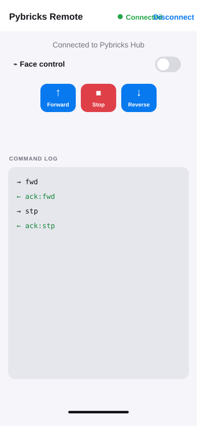

# Pybricks Remote for iPhone — User Guide

Pybricks Remote controls a Pybricks-powered LEGO SPIKE Prime hub over Bluetooth Low Energy. It provides manual Forward, Stop, and Reverse controls, a command/ACK log, and optional face-motion control.

## Before you start

1. Install the app on your iPhone from Xcode.
2. Power on the SPIKE Prime hub and ensure it runs Pybricks firmware.
3. Upload and start the compatible hub program. It must accept the three-byte commands `fwd`, `stp`, and `rev`, and return `rdy` followed by `ack:<command>`.
4. Close other apps connected to the hub. The hub can have only one active host connection.

When iOS prompts you, allow **Bluetooth**. Allow **Camera** only if you plan to use Face control.

## Connect to the hub

1. Open Pybricks Remote. It scans automatically; use **Scan** to repeat the scan.
2. Tap **Pybricks Hub** in the nearby-hub list.
3. The top bar changes to a green **Connected** state. Start the hub program if the buttons remain disabled.

## Manual motor control

Tap one command at a time:

- **Forward** sends `fwd`.
- **Stop** sends `stp`.
- **Reverse** sends `rev`.

The app waits for the hub to acknowledge a command before enabling the next one. In the command log, `→` is a command from the phone and `← ack:` is the hub’s confirmation.

## Face control

1. Connect to the hub and turn on **Face control**.
2. Grant Camera permission when asked.
3. Center your face in the live camera window.
4. Move your face clearly to the left to send **Forward**. Move it to the right to send **Reverse**.
5. Turn Face control off when you are finished.

Face control has a small dead zone and a short cooldown to reduce accidental movements. The camera feed is processed locally on the phone and is not saved by the app.

## Troubleshooting

| Problem | What to do |
| --- | --- |
| No hub appears | Power-cycle the hub, verify that it runs Pybricks firmware, and tap **Scan**. |
| Buttons are disabled | Start the hub program and wait for its `rdy` message. |
| The app stops after a command | Verify the hub sends `ack:` plus the original three-byte command. |
| Face control does not start | Check **Settings → Pybricks Remote → Camera** and allow access. |
| Motion is too sensitive | Keep your head still between commands; the cooldown prevents rapid repeats. |

## Safety

Keep the robot on a clear surface, use **Stop** before picking it up, and turn off Face control before moving away from the robot.

> The images in this guide are UI reference screenshots for the iPhone 13 layout; exact spacing may vary slightly with iOS settings.
