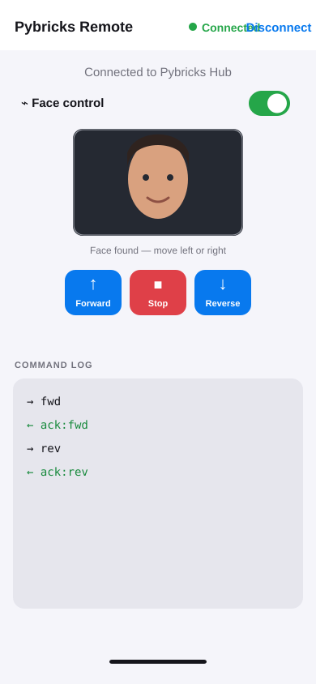

# Wall-E Companion for iPhone — User Guide

Wall-E Companion controls the Wall-E-style LEGO SPIKE Prime build over Bluetooth Low Energy. It provides manual drive and head controls, optional face-motion and voice control, live robot telemetry, and a stationary-only YouTube Music link.

## Before you start

1. Install **Wall-E Companion** on your iPhone from Xcode.
2. Power on the SPIKE Prime hub and ensure it runs Pybricks firmware.
3. Upload and start [`walle_companion_excited_eyes.py`](../walle_hub/walle_companion_excited_eyes.py) in the Pybricks app.
4. Close other apps connected to the hub. The hub can have only one active host connection.

When iOS prompts you, allow **Bluetooth**. Allow **Camera**, **Microphone**, and **Speech Recognition** for the optional face and voice features.

## Connect to the hub

1. Open Wall-E Companion. It scans automatically; use **Scan** to repeat the scan.
2. Tap the discovered **Pybricks Hub**.
3. Wait for the green **Robot ready** state. If the app says to start the program, start the Pybricks program and wait for its `READY` message.

## Layout and telemetry

In landscape, the remote uses two panels:

- The **face-control panel** contains the live camera preview, its status, the Face control switch, and the face-distance settings.
- The **robot-control panel** contains robot readiness, distance/reflection/touch/head/wheel telemetry, voice control, manual buttons, and music.

The camera panel is placed on the opposite side of the phone from its physical front-camera lens as the phone rotates. The command log is not shown in the current layout.

## Manual robot control

- **Left** and **Right** pivot Wall-E in the matching direction.
- **Stop** immediately stops both wheels.
- **Head L** and **Head R** pan the head.

The app sends `DRV`, `STOP`, and `HEAD` commands to the hub. The hub returns `ACK`, `SAFE`, `WHEELS`, and `TEL` messages; the current telemetry is shown in the robot-control panel.

## Face control

1. Connect to the hub and turn on **Face control**.
2. Grant Camera permission when asked.
3. Center your face in the live camera window.
4. Move your face left or right to turn Wall-E. Keep your face in the centre band to stop.
5. Use **Face distance** to set the desired face-width range: a face that is too small makes Wall-E move closer; a face that is too large makes Wall-E back away.
6. Turn Face control off when you are finished.

Face control has a small dead zone and a short cooldown to reduce accidental movements. The camera feed is processed locally on the phone and is not saved by the app.

## Voice control

Tap **Voice command**, then say one of the supported commands: “forward”, “back” or “reverse”, “stop”, “look left”, or “look right”. Tap again to stop listening.

## Stationary music

1. Press Wall-E's shoulder Force Sensor to disable the wheels.
2. Confirm the telemetry says `wheels=0` or the camera panel shows **Wheels disabled — stopped**.
3. Tap **Play WALL-E music**.

The link is disabled while wheels are enabled. When available, it opens the configured YouTube radio on the iPhone; playback is handled by YouTube or the browser.

## Troubleshooting

| Problem | What to do |
| --- | --- |
| No hub appears | Power-cycle the hub, verify that it runs Pybricks firmware, and tap **Scan**. |
| Robot is not ready | Start `walle_companion_excited_eyes.py` and wait for `READY`. |
| Wheels will not move | Check the shoulder toggle. `wheels=0` means the wheels are deliberately disabled. |
| Face control does not start | Check **Settings → Wall-E Companion → Camera** and allow access. |
| Camera preview is on the wrong side | Rotate the phone once more; the preview follows the screen orientation and stays opposite the physical front lens. |
| Motion is too sensitive | Widen the Face distance range or keep your head still between commands; the cooldown prevents rapid repeats. |
| Music link is disabled | Disable the wheels with the shoulder Force Sensor first. |

## Safety

Keep the robot on a clear surface, use **Stop** before picking it up, and turn off Face control before moving away from the robot. The shoulder Force Sensor is the immediate wheel-disable control.

> The images in this guide are UI reference screenshots; the current Wall-E Companion layout and spacing vary with iPhone size, orientation, and iOS settings.
