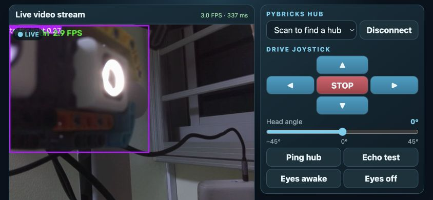
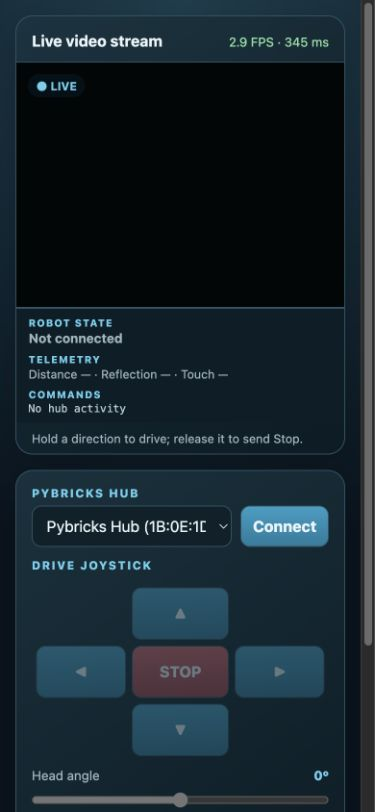

# Wall‑E Raspberry Pi Web Control Deck — User Guide

The Raspberry Pi 4 web control deck lets a phone, tablet, or computer view the live YOLO camera stream and control the Pybricks-powered Wall‑E companion over the local network. The Pi owns the camera and BLE connection; the browser is the control surface.

## Before you start

1. Power the Raspberry Pi 4, webcam, and SPIKE Prime hub.
2. Ensure the Pi web app is running. From another device on the same network, open `http://<pi-ip-address>:5000`.
3. In the Pybricks app, upload and run [`walle_companion_excited_eyes.py`](../walle_hub/walle_companion_excited_eyes.py) on the hub.
4. Disconnect the iPhone app or any other BLE client. The hub accepts one active host connection at a time.
5. Put Wall‑E on a clear surface. For a first motor test, place it on a stand.

The app needs a USB webcam by default. The Pi must have Bluetooth and camera access; see the [web-app deployment guide](../rpi_yolo_webapp/README.md) if the control deck does not start.

## Connect to the hub

1. Open the control deck in a browser.
2. Tap **Scan**. The button scans for a Pybricks hub.
3. When a hub is found, it is selected in the list and the same button changes to **Connect**. Select another discovered hub first if necessary.
4. Tap **Connect**.
5. Wait for the video panel’s **Robot state** to show **Connected — robot ready**. If it asks you to start the program, start the Pybricks hub program and wait for its `READY` message.

Once connected, the one button changes to **Disconnect**. Tapping it stops the active web connection; it does not power off the hub.

## Layout

In landscape orientation, the page uses two horizontal panels:

- The **video panel** contains the live YOLO feed, FPS/inference status, Robot state, telemetry, and recent command log.
- The **control panel** contains the hub selector/connection button, drive joystick, head-angle slider, and diagnostic/eye controls.

Portrait mode stacks the panels for easier reading on a narrow phone.

### Video status strip

The strip below the video shows:

| Field | Meaning |
| --- | --- |
| Robot state | Connection, readiness, or safety status from the hub. |
| Telemetry | Distance (`d`), color reflection (`r`), shoulder touch (`touch`), head angle (`h`), and wheel-enable state when reported. |
| Commands | The most recent commands sent to and responses received from the hub. |

The camera status in the video header reports the current Pi inference FPS and inference time. A camera error means video detection is unavailable; it does not change the hub’s independent motor safety rules.

## Drive Wall‑E

1. Wait until the Robot state says **Connected — robot ready**.
2. Press and hold a joystick arrow to drive or pivot.
3. Release the arrow to send `STOP`.
4. Use the red **STOP** button at any time to stop both wheels.

Keyboard control is also available when using a computer:

- Arrow keys: drive forward, reverse, left, or right.
- Space: stop.

For the current assembled chassis, the physical steering mapping is:

| Control | Hub command |
| --- | --- |
| Left | `DRV -35 35` |
| Right | `DRV 35 -35` |
| Forward | `DRV -35 -35` |
| Reverse | `DRV 35 35` |

The app refreshes held drive commands before the hub’s two-second timeout. If the browser becomes hidden, loses focus, or the direction is released, it stops driving.

## Head, diagnostics, and eyes

### Head angle

Drag the **Head angle** slider to set a target from −45° to 45°. The hub applies the target safely and reports its measured angle in telemetry.

### Diagnostics

- **Ping hub** sends `PING`; a healthy hub replies `ACK PING`.
- **Echo test** sends an `ECHO` diagnostic line. It confirms command framing and return notifications without moving the robot.

Use either control to check that BLE is responsive before driving. A successful diagnostic reply does not prove that the floor around the robot is safe.

### Eye lights

- **Eyes awake** applies a balanced light pattern to the Color Sensor and Ultrasonic Sensor eyes.
- **Eyes off** turns off both eye-light assemblies.

Manual eye-light controls override the hub’s idle/excited animation until the hub program is restarted. They do not affect obstacle detection or wheel safety.

## Safety

- Keep people, pets, and obstacles clear before driving.
- Use the red **STOP** button before handling Wall‑E.
- The Ultrasonic Sensor prevents forward movement when an obstacle is closer than 180 mm.
- Pressing Wall‑E’s shoulder Force Sensor stops the wheels and toggles their enabled state.
- When telemetry reports `wheels=0` or the command log shows `WHEELS OFF`, the wheels are intentionally disabled. Press the shoulder sensor again to re-enable them.
- A `SAFE obstacle`, `SAFE shoulder`, or `SAFE wheels-disabled` message is a hub safety decision. Clear the cause and deliberately issue a new movement command; the web app will not resume motion automatically.

## Troubleshooting

| Problem | What to do |
| --- | --- |
| The page will not open | Confirm the Pi and phone are on the same network, then browse to `http://<pi-ip-address>:5000`. |
| Camera is black or reports an error | Check USB power/cable, confirm no other process owns the camera, and run `v4l2-ctl --list-devices` on the Pi. |
| No hub is found | Power-cycle the hub, confirm Pybricks firmware, stop other BLE clients, and tap **Scan** again. |
| Connect is unavailable after scanning | Select a discovered hub in the list; the single connection button then becomes **Connect**. |
| Robot is connected but not ready | Start `walle_companion_excited_eyes.py` and wait for `READY`. |
| Wheels will not move | Check for `SAFE` messages, clear obstacles, and check the shoulder wheel toggle. |
| Left and right are reversed | Confirm the current hub program and the web control deck are updated. If the robot was assembled differently, recalibrate `LEFT_SIGN` / `RIGHT_SIGN` using a stand test. |
| Video is slow | The Pi 4 runs YOLO on its CPU. Close extra browser viewers, start with 640×480 camera capture and `imgsz=320`, and check the displayed FPS. |

## Stop or shut down

1. Tap **STOP**.
2. Tap **Disconnect** when finished using the web control deck.
3. Stop the Pybricks program or power off the hub only after the wheels have stopped.

For installation, camera configuration, and the systemd service, see the [Raspberry Pi web-app README](../rpi_yolo_webapp/README.md). For the shared BLE protocol, see the [Pybricks Hub Integration Protocol](pybricks-hub-integration-protocol.md).
